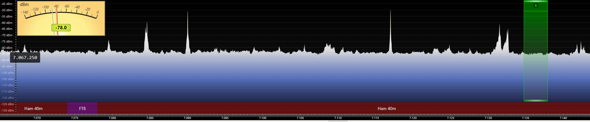
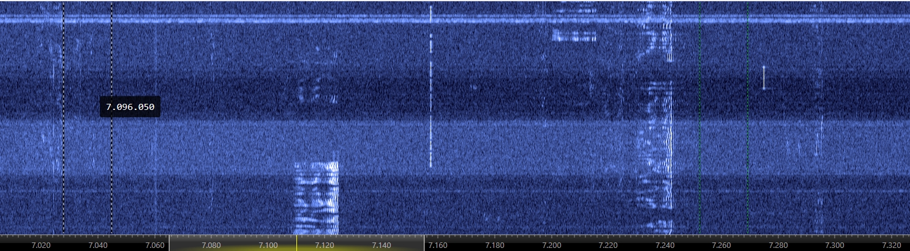

这是一个新项目，使用python开发。目的是实现业余无线电CW模式的自动收发通讯功能。

功能描述：

通过电脑的音频输入，分析电台传来的音频信号，绘制专业的频谱和瀑布图。可以清晰的看到信号的强弱变化，并按CW模式的带宽截取相应的带宽的音频信号。

可以设置采集音频的带宽，如3000Hz，CW模式的截取带宽为150Hz.

将获取的音频信号，进行强化处理，让较弱的CW信号更清晰可辨，并通过音频输出设备播放音频，用于监听。同时将这个处理后的信号进行CW解码，将解码信息显示在CW接收窗口中。

通过对接大语言模型，将接收到的CW输入给模型，获取最合适的返回CW通讯代码，并且将这个代码输入到CW回复窗口中，可以设置手动回复或者自动回复，CW回复窗口中的内容可以随时修改。

如果设置自动回复，在确认接收到准确字符后，并生成了合适的回复字符，且对方电台暂时没有发射信息时，自动将回复的内容通过CW编码发送到音频的输入接口。这里CW的音频生成频率可以设定，如700hz。

完成一次成功的QSO后，会自动记录通联记录，可以记录在本地，也可以通过UDP协议发送到日志系统。

未来还需要支持电台的自动操作，主要时发送时，启动PPT，通过USB接口实现。主要支持的电台Yaesu的FTDX10。

我们首先需要实现程序的主界面，然后根据需求开发后续功能。

主界面样式描述和布局如下：

音频设置：

输入设备：（CW信号的输入设备，从系统中调用输入音频设备清单，下拉菜单选择）
输出设备：（CW信号的输出设备，从系统中调用输出音频设备清单，下拉菜单选择）
监听设备：（CW信号的监听设备，从系统中调用输出音频设备清单，下拉菜单选择）

监听音频 （这里时一个复选框，选择后将处理过的音频发送给监听设备播放）

大语言模型设置：

DDeepseek-chat （选择已经安装的模型下拉菜单）        【安装模型】

频谱图：

瀑布图：

接收CW信息：

发送CW信息：

【开始接收】   【发送】    []自动发送  []本地日志   []远程日志  【设置】

以上是主界面的样式。

界面的图例说明：[] 表示复选框  【】这个表示是一个按钮

我们先实现主界面的功能，全部设置保存到配置文件中，每次启动可以读取和设置之前的配置状态。

根据文档内容开始创建次项目，我们分步骤进行开发，目前先实现程序的主界面，并创建install.bat和start.bat文件，install.bat用于安装conda虚拟运行环境和必要的支持包，start则是启动项目。
